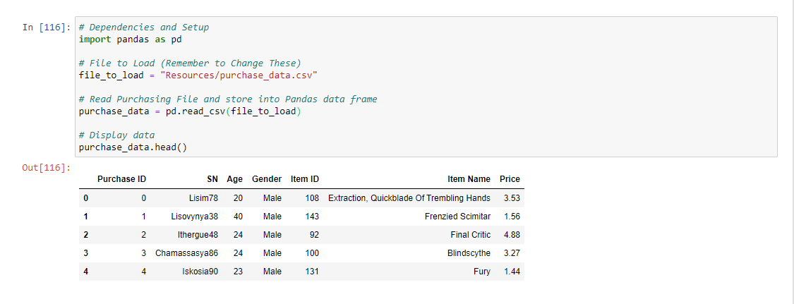
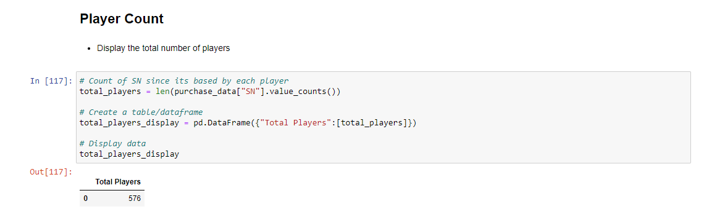
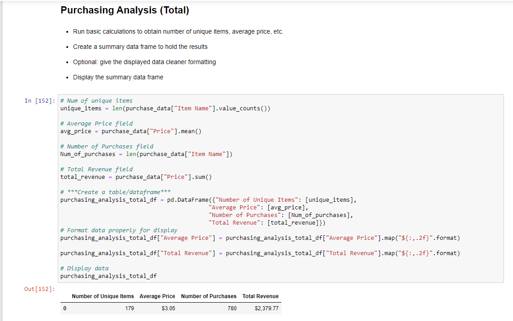

# pandas-challenge

**Data Analysis For Heroes of Pymoli spreadsheet with in game data**

The datapoints used are:

A) Purchase index

B) Screen Name(SN)

C) Age

D) Gender

E) Item ID

F) Item Name

G) Price

**Analysis Tables:**

1) Preview of first 5 entries of table

2) Player Count

3) Purchasing Analysis (Total)

4) Gender Demographics

5) Purchasing Analysis(Gender)

6) Age Demographics

7) Purchasing Analysis(Age)

8) Top Spenders

9) Most Popular Items

10) Most Profitable Items

**Note** The tables on github do not look as clean as on the jupyter notebook IDE which is why I've attached images to the readme incase user does not want to clone them locally and see them on an ide. The file is located inside my_submission directory. It is called [HeroesOfPymoli_starter.ipynb](https://github.com/slobanwala1/pandas-challenge/blob/main/my_submission/HeroesOfPymoli/HeroesOfPymoli_starter.ipynb). The Images are located in [Resources/Images](https://github.com/slobanwala1/pandas-challenge/tree/main/my_submission/HeroesOfPymoli/Resources/Images).

## Here are the snapshots by statistics analyzed:

**Preview of first 5 entries of table**

 
 

**Player Count**

 
 

**Purchasing Analysis (Total)**

 
 
